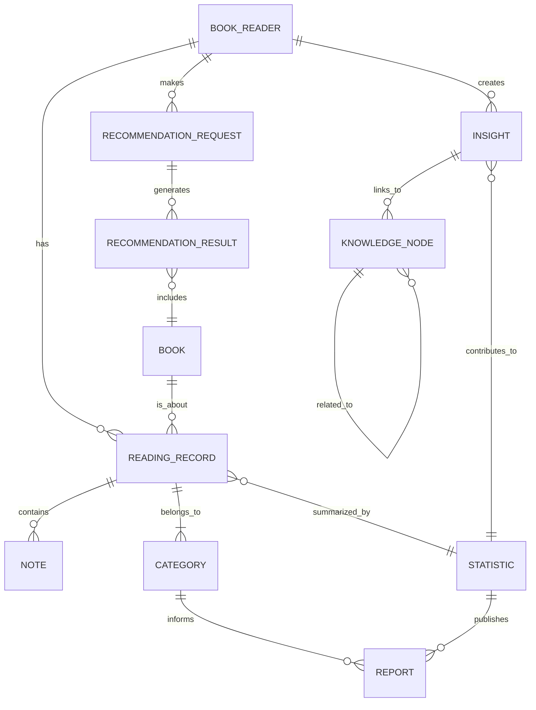

# 领域模型（Domain Model）

## 一、统一语言（Ubiquitous Language）

为确保团队成员对领域概念的共同理解，以下为核心术语及其定义：

- **BookReader**：使用系统管理阅读和笔记的主体。
- **Book（图书）**：可通过本地或在线资源导入的阅读对象。
- **ReadingRecord（阅读记录）**：用户对一本图书的阅读事件，包含时间戳、关联笔记等。
- **Note（笔记）**：针对阅读记录的文字或图像附加信息，用以捕捉洞见。
- **Category（分类）**：对阅读记录的手动或自动主题分组，用于组织内容。
- **RecommendationRequest（推荐请求）**：用户触发算法生成书籍推荐的操作实体。
- **RecommendationResult（推荐结果）**：由推荐请求产生的一组图书及其推荐理由。
- **Insight（见解）**：用户对阅读记录进行深度思考后形成的文本表达，可链接思想节点。
- **KnowledgeNode（知识节点）**：系统内预定义或用户创建的思想实体，用于连接见解。
- **Statistic（统计）**：基于阅读记录与见解计算的聚合数据，用于报告绘制。
- **Report（报告）**：可视化或结构化的统计与分析结果，呈现阅读和知识图谱。

## 二、核心思路与设计流程
1. 确认核心模块和对应的业务用例，提取主要业务活动：
   - SAVE：图书导入、笔记保存、分类管理
   - NEXT：书籍推荐、推荐刷新、下载管理
   - RECALL：回顾记录、见解添加、见解关联
   - REPORT：阅读统计、主题分析、知识图谱展示
2. 从用例中提炼实体（Entity）和它们的属性（Attribute）以及实体间关系（Relation）。
3. 绘制实体-关系图（ER 图）或类图，说明各实体之间的聚合、关联、继承等。
4. 编写每个实体的简要说明：含义、主要属性及方法。

## 三、领域模型图（Mermaid ER 图）

## 四、核心实体说明

### 1. BookReader（读书人）
- 属性：
  - userId: UUID
  - name: String
  - email: String
- 关系：
  - 拥有多个 ReadingRecord、RecommendationRequest、Insight

### 2. Book（图书）
- 属性：
  - bookId: UUID
  - title: String
  - author: String
  - format: Enum {PDF, EPUB, TXT}
  - source: Enum {LOCAL, ONLINE, DATABASE}
- 关系：
  - 被多个 ReadingRecord、RecommendationResult 引用

### 3. ReadingRecord（阅读记录）
- 属性：
  - recordId: UUID
  - userId: UUID
  - bookId: UUID
  - timestamp: DateTime
- 关系：
  - 包含多个 Note
  - 属于一个 Category

### 4. Note（笔记）
- 属性：
  - noteId: UUID
  - recordId: UUID
  - content: Text
  - attachments: List<Image|File>

### 5. Category（分类）
- 属性：
  - categoryId: UUID
  - name: String
  - type: Enum {MANUAL, AUTO}
- 关系：
  - 可包含多个 ReadingRecord

### 6. RecommendationRequest（推荐请求）
- 属性：
  - requestId: UUID
  - userId: UUID
  - algorithm: Enum {AlgA, RzvdAlgB}
  - timestamp: DateTime

### 7. RecommendationResult（推荐结果）
- 属性：
  - resultId: UUID
  - requestId: UUID
  - books: List<Book> (top-3)
  - reason: String

### 8. Insight（见解）
- 属性：
  - insightId: UUID
  - userId: UUID
  - content: Text
  - timestamp: DateTime
- 关系：
  - 可链接到多个 KnowledgeNode

### 9. KnowledgeNode（知识节点）
- 属性：
  - nodeId: UUID
  - name: String
  - description: Text
- 关系：
  - 与其他 KnowledgeNode 关联形成图谱

### 10. Statistic（统计）
- 属性：
  - statId: UUID
  - type: Enum {DAILY, WEEKLY, MONTHLY, YEARLY}
  - data: JSON
- 关系：
  - 从 ReadingRecord、Insight 汇总生成

### 11. Report（报告）
- 属性：
  - reportId: UUID
  - userId: UUID
  - type: Enum {CHART, KNOWLEDGE_GRAPH, THEME_ANALYSIS}
  - content: JSON|Diagram
- 关系：
  - 基于 Statistic 和 Category 生成

## 五、业务边界（Bounded Context）与聚合根（Aggregate Root）划分

### 1. 有限上下文（Bounded Context）

- **SAVE Context**：负责图书导入、笔记保存和分类管理
- **NEXT Context**：负责书籍推荐、刷新推荐和下载管理
- **RECALL Context**：负责阅读回顾、见解添加和关联
- **REPORT Context**：负责统计可视化、主题分析和知识图谱展示

### 2. 聚合根（Aggregate Roots）划分

- **SAVE Context**：
  - 聚合：`BookAggregate`
    - 根实体：`Book`
    - 边界内实体：`ReadingRecord`、`Note`、`Category`

- **NEXT Context**：
  - 聚合：`RecommendationAggregate`
    - 根实体：`RecommendationRequest`
    - 边界内实体：`RecommendationResult`

- **RECALL Context**：
  - 聚合：`InsightAggregate`
    - 根实体：`Insight`
    - 边界内实体：`KnowledgeNode`

- **REPORT Context**：
  - 聚合：`ReportAggregate`
    - 根实体：`Report`
    - 边界内实体：`Statistic`、`Category`

### 3. 划分原则与实践

- 聚合根负责维护其边界内的数据一致性和业务规则
- 聚合间仅通过标识符（ID）引用，避免跨聚合事务
- 仅在聚合根上公开操作接口，其他实体通过聚合根进行访问

---
以上领域模型已覆盖主要业务流程和数据结构，满足后续系统设计和开发需求。如需增加其他场景或细化属性，可进一步迭代更新。
